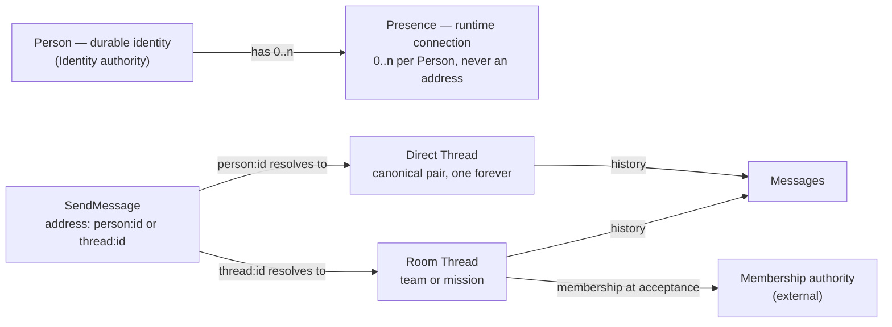

# Messaging — Capability Architecture Blueprint (First Pass)

**Status:** First pass — decision depth, not implementation depth.
**Scope:** The Messaging capability only. This document is the standard; existing code is evidence, not authority.
**Passes:** (1) this blueprint → (2) contract specification (schemas, signatures) → (3) implementation design.

---

## 1. Capability Promise

**Messaging owns the durable, addressed exchange of Messages between Persons — 1-to-1 and 1-to-many — with guaranteed acceptance, honest delivery outcomes, and policy-controlled attention (DND, urgency, contacts) — for any host that can satisfy its public contract.**

- **Consumers:** the Novakai Command app, externally spawned agents (CLI/terminal), standalone applications, other capabilities (e.g. Mission Rooms), and operator CLIs.
- **Owns:** Thread and Message history, delivery state, attention policies, templates, and the public contract for all of it.
- **Does not own:** Person identity records, team/mission membership truth, read-state UX, or transport internals.

The promise holds whether Messaging runs embedded in Novakai Command, standalone behind a network protocol, or inside a future host that doesn't exist yet.

---

## 2. Consumers and Composition Scenarios

| Consumer | Needs | Entry point | Must NOT know | Process |
|---|---|---|---|---|
| Novakai Command backend | send/query/subscribe on behalf of the app | Embedded typed interface | JSONL layout, delivery internals | In-process |
| External terminal-spawned agent (e.g. a Chief) | connect, authenticate, send, receive | Standalone protocol (WS or CLI) | Novakai Command exists at all | Out-of-process |
| Two external Chiefs | direct 1-1 exchange | Standalone protocol | the other agent's runtime details | Out-of-process |
| Mission Rooms capability | reference Threads/Messages by ID; post mission events | Capability-to-capability contract | Message internals, delivery state | Either |
| Operator CLI (`nvk`-style) | send, inspect, query delivery | CLI adapter over the same core | storage format | Out-of-process |
| **Second host (proof): a standalone messenger app** | full send/query/subscribe with its own UI | Standalone protocol + published projections | any Novakai-specific object | Out-of-process |

**Second-host test:** the standalone messenger app provisions identity through the published identity requirement, sends/queries/subscribes through the public contract, renders its own UI from published projections, imports no private code, and requires no change to the Messaging core.

---

## 3. Non-Goals

- **Message editing and deletion** — history is append-only (v1).
- **Read receipts / read cursors** — a host-side projection concern; Messaging exposes delivery state only.
- **End-to-end encryption** — local-first trust model (v1).
- **Person identity administration** — provisioning Persons belongs to the Identity authority.
- **Team/mission membership administration** — owned by those capabilities; Messaging resolves it at a seam.
- **Presence liveness heuristics** — a Presence is a connection; judging "is this agent thinking" is a host concern.
- **Cross-machine federation** — single authority deployment (v1).
- **Agent reasoning about messages** — Messaging delivers; it never interprets content or triggers turns.

---

## 4. Elite Engineering Scorecard

The measuring tool for this design and everything that follows it. Weighted dimensions, 0–5 rating each:

`dimension points = weight × rating ÷ 5` — **Elite = total ≥ 90 AND every red gate passes.**

| Dimension | Weight | What is measured | Design-stage status |
|---|---:|---|---|
| Capability ownership & domain authority | 15 | One owner per durable fact; typed identity; no competing authorities | **Specified** (§10, §12) |
| Module depth & information hiding | 15 | Consumers learn only the small public contract; policy stays private | **Specified** (§9, §13) |
| Coupling & dependency direction | 15 | No cycles; adapters depend toward the core; cross-capability by contract only | **Specified** (§14) |
| Composability & second-host proof | 15 | Standalone + larger-host integration with no core change | **Unproven** until §15 proofs run |
| Contract correctness & compatibility | 10 | Runtime schemas, typed outcomes, idempotency, versioning | **Specified** (§9) — schemas in pass 2 |
| Verification & failure resilience | 15 | Contract/invariant/adapter/failure-injection tests | **Unproven** until implementation |
| Changeability & code health | 10 | Low change amplification; no dead public surface | **Unproven** until implementation |
| Operability & security | 5 | Authenticated identity, authorization, bounded resources, actionable failure truth | **Specified** (§8, §9, §11) |

**Reporting rule:** `Specified` = the architecture commits to it; `Unproven` = requires implementation evidence; points are never awarded to unbuilt code. Re-scored after every delivery slice (§18).

---

## 5. Red Gates

Any one failure rejects the architecture regardless of score:

| # | Gate | Required |
|---|---|---:|
| G1 | Authoritative writers per durable record | exactly 1 |
| G2 | Durable relationships using display names, session IDs, PIDs, or cwd | 0 |
| G3 | Sender identity taken from caller-supplied payload | 0 |
| G4 | Private implementation importable by any consumer | 0 |
| G5 | Public contract exposing storage, framework, or transport details | 0 |
| G6 | Silent failure paths (any failure without a typed outcome or event) | 0 |
| G7 | Accepted Messages that can disappear without recovery | 0 |
| G8 | Host-specific concepts (React, Express, Electron, PTY types) inside the core | 0 |
| G9 | Group send producing competing copies of conversation history | 0 |
| G10 | Delivery state machine settling "delivered" without an adapter effect | 0 |
| G11 | Dependency cycles across capabilities | 0 |
| G12 | Seams without a real variability, effect, ownership, or trust boundary | 0 |
| G13 | Second-host integration proof | 1, passing |
| G14 | Load-bearing decisions (§7) left Open while treated as settled | 0 |

---

## 6. Requirements Catalogue

Every behaviour: stable ID, observable description, proof obligation.

| ID | Behaviour | Proof obligation |
|---|---|---|
| MSG-001 | An authenticated Person can send a Message to another Person using only the recipient's Person ID. | Send via public contract; Message appears in the direct Thread; no private imports. |
| MSG-002 | An authenticated Person can send one Message to a Team destination, reaching all members at acceptance time. | One Message, one Thread, one Delivery per snapshotted recipient. |
| MSG-003 | An authenticated Person can send one Message to a Mission destination. | As MSG-002 with Mission resolution. |
| MSG-004 | An agent spawned outside Novakai Command (terminal/CLI) can provision identity, connect, and authenticate without any Novakai-specific object. | Second-host scenario passes (§15, P2). |
| MSG-005 | Two externally spawned agents can exchange Messages 1-to-1. | External↔external scenario passes (§15, P3). |
| MSG-006 | Any consumer can pull Messages for a Thread by typed query. | Query returns ordered Messages with durable IDs. |
| MSG-007 | Any connected consumer can subscribe to push events (new Messages, delivery updates, presence changes). | Events arrive on the subscription without polling. |
| MSG-008 | An urgent Message requests immediate attention at the recipient's live Presence (e.g. PTY steer) when policy permits. | Urgent path exercised; adapter effect observed. |
| MSG-009 | A Person can enable DND; non-urgent pushes are then held but remain pullable. | Held state visible in Delivery; pull returns the Message. |
| MSG-010 | Only a principal with the override grant can push through DND; an urgent send without it downgrades with a typed outcome, never silently. | Both paths demonstrated; outcomes typed. |
| MSG-011 | Delivery integrates with PTY presences through a replaceable adapter. | PTY adapter passes the shared adapter contract suite. |
| MSG-012 | Every Message is a JSON object with a unique durable ID, `kind`, `schemaVersion`, `createdAt`. | Schema validation at the seam; ID uniqueness enforced. |
| MSG-013 | Only the public API and CLI are consumable; private modules are not importable. | Architecture test: no public import from private paths. |
| MSG-014 | Addressing is by typed ID only; unknown or mistyped recipients fail with a typed error at send time. | Unknown-recipient send returns `UnknownRecipient`. |
| MSG-015 | A Person can restrict who may send to them via a contact policy. | Blocked sender receives `BlockedByContactPolicy`. |
| MSG-016 | Delivery failures are observable as events/queryable state without creating an agent turn. | Failure produces `DeliveryFailed` event; no ack turn required. |
| MSG-017 | Message templates with schema-bound fields can be created and sent. | Template send validates fields against the Message schema. |
| MSG-018 | Retrying a send after a lost response does not create a duplicate Message. | Same `clientMessageId` returns the original acceptance. |
| MSG-019 | A successful send has crossed the durability boundary before any delivery effect. | Kill-after-accept walkthrough (§16, W2): Message survives. |
| MSG-020 | Sender identity derives from authentication, never from payload fields. | Payload `from` is rejected/ignored; spoof attempt fails. |
| MSG-021 | Strict TypeScript; all external input parsed from `unknown` at the seam. | `tsc --strict` clean; fuzzed invalid payloads rejected. |
| MSG-022 | A second host integrates without changing Messaging core code. | Second-host scenario passes (§15, P1). |

Vague words banned in this catalogue: *reliable, seamless, flexible, fast* — each appears only with a measurable guarantee attached.

---

## 7. Load-Bearing Decisions

Statuses: **Proposed** · Accepted · Open · Rejected · Deferred. Schemas wait for acceptance.

| ID | Question | Status | Chosen direction | Rationale | Invalid if changed |
|---|---|---|---|---|---|
| DEC-01 | What is addressable identity? | **Proposed** | The durable **Person** (`person_<id>`). Presence is never an address. | Runtime connections die; identity must not. | Entire addressing model, contact policy |
| DEC-02 | Is durable identity separate from runtime presence? | **Proposed** | Yes — Person is durable, Presence is ephemeral runtime attachment (multiple allowed). | A Person may have 0 or 2 live runtimes without changing identity. | Presence seam, delivery fan-out |
| DEC-03 | How are direct conversations identified? | **Proposed** | Deterministic direct Thread from the canonical sorted Person pair — one per pair, forever. | Stable across restarts, projects, runtimes; no lookup race. | Thread model, direct-send path |
| DEC-04 | How are Team/Mission conversations identified? | **Proposed** | A Room Thread (`thread_<id>`, kind `team`\|`mission`) referencing exactly one external membership authority. | Membership truth stays with its owner. | Recipient snapshots, membership seam |
| DEC-05 | Group send: one Message or many? | **Proposed** | **One** Message in one Thread + one Delivery per recipient. | No competing history copies (red gate G9). | Delivery model, events |
| DEC-06 | Who owns conversation history? | **Proposed** | Messaging — Threads and Messages are authoritative here. | One authority per fact. | Ownership map |
| DEC-07 | Who may override DND? | **Proposed** | Principals holding the `priority.override` grant, verified via the Authority seam. Urgent without the grant downgrades with a typed outcome. | Attention is a permission, not a convention. | DND policy, urgent path |
| DEC-08 | What does "delivered" mean? | **Proposed** | A real adapter effect occurred for that recipient's live Presence (e.g. bytes into the PTY, frame onto the socket). Never "written to journal". | The audit found "delivered" being settled without an effect; this forbids it (G10). | Delivery state machine |
| DEC-09 | What is durable acceptance? | **Proposed** | The Message and its recipient snapshot are committed to authoritative storage before any adapter effect runs. | Accept-then-crash loses nothing (MSG-019). | Send pipeline, commit boundary |
| DEC-10 | Which guarantees belong to the capability vs adapters? | **Proposed** | Capability: acceptance, ordering, idempotency, policy, honest outcomes. Adapters: transport effect only. | Behaviour must not diverge by host. | Seam definitions, adapter suites |
| DEC-11 | Sender identity source? | **Proposed** | The authenticated principal only. Payload sender fields are rejected. | Trust never crosses the seam from caller data (G3). | Send command shape, auth seam |
| DEC-12 | Urgency shape? | **Proposed** | A `priority: normal \| urgent` field on SendMessage — not separate commands. | One path, one policy decision point. | Contract catalogue |
| DEC-13 | Idempotency mechanism? | **Proposed** | Client-supplied `clientMessageId` (unique per sender); a retry returns the original acceptance. | Lost responses are normal; duplicates are not. | Send semantics, storage key |
| DEC-14 | Contact policy default? | **Proposed** | Per-Person ContactPolicy: allowlist + a default rule (`deny` for unconnected external Persons; members of shared Threads implied-allowed). | External agents must be reachable deliberately, not accidentally. | Contact enforcement point |
| DEC-15 | Templates bound to what? | **Proposed** | Templates declare fields bound to paths in the Message schema; sending validates against that schema. | Templates can't drift from the contract. | Template commands |
| DEC-16 | Multi-Presence fan-out? | **Proposed** | Push attempts all live Presences of a recipient; Delivery settles delivered on the first real effect. | A Person on two machines misses nothing. | Delivery state machine |
| DEC-17 | Standalone protocol? | **Proposed** | Versioned JSON-over-WebSocket protocol + a CLI adapter, both translating into the same core. | External agents are the primary standalone consumer; CLI falls out free. | Protocol adapter, §15 proofs |

---

## 8. Identity and Addressing Model

**Concepts:**

| Concept | Nature | Owned by | Notes |
|---|---|---|---|
| **Person** (`person_<id>`) | Durable | Identity authority (external capability) | The only addressable identity. Referenced by Messaging, never owned. |
| **Presence** (`presence_<id>`) | Ephemeral | Messaging | A live authenticated connection of a Person. Multiple per Person allowed. Never an address. |
| **Address** | Value | Messaging | A typed destination: `person:<id>` or `thread:<id>`. Resolved at send time. |
| **Principal** | Runtime trust | Authority seam | The authenticated caller: Person ID + verified grants. Produced by authentication, not by payload. |
| **Thread** (`thread_<id>`) | Durable | Messaging | Direct (canonical pair) or Room (team/mission). The unit of history. |

**Rules:**

- Identity never derives from display names, terminal sessions, PIDs, or working directories (G2).
- **External agents connect** by provisioning a Person credential with the Identity authority, then authenticating over the standalone protocol; on success a Presence is registered.
- **Direct destinations:** `person:<id>` resolves to the canonical direct Thread for the sender↔recipient pair (DEC-03).
- **Team/Mission destinations:** `thread:<id>` resolves membership through the Membership seam at acceptance; the resolved recipient set is frozen into a recipient snapshot.
- **Self-send:** permitted — the direct Thread for `(me, me)` is a durable personal lane.
- **Membership changes** after acceptance never rewrite the recipient snapshot or history; they affect only future sends (§12).
- **Presence** changes delivery attempts only — never identity, addressing, or history.

*Answers: what is an address vs an identity vs a connection? Audience: builders + reviewers. Status: proposed. Takeaway: only Persons are addressable; Threads own history; Presence is just where delivery can land.*

---

## 9. Public Contract Catalogue

Names and semantics only — property-level schemas arrive in pass 2, after §7 decisions are accepted.
Identity note: **every command executes as an authenticated Principal**; there is no `from` field anywhere.

### Commands (request state change)

| Name | Caller | Authority | Semantics | Success result | Named failures |
|---|---|---|---|---|---|
| `OpenPresence` | any principal | valid credential | Register a live connection for this Person | `PresenceOpened { presenceId }` | `NotAuthenticated`, `VersionUnsupported` |
| `ClosePresence` | presence owner | own presence | Deregister a live connection | `PresenceClosed` | `NotAuthenticated` |
| `SendMessage` | any principal | `send` + contact policy | Accept one Message to an address (person or thread), `priority: normal\|urgent`, idempotent by `clientMessageId` | `SendAccepted { messageId, threadId, urgentDowngraded? }` | `NotAuthenticated`, `NotAuthorized`, `UnknownRecipient`, `BlockedByContactPolicy`, `ValidationFailed` |
| `SendFromTemplate` | any principal | as SendMessage | Render a template with fields, then accept as SendMessage | `SendAccepted` | as SendMessage + `TemplateNotFound`, `TemplateFieldMismatch` |
| `SetDndPolicy` | self or admin | self, or `policy.admin` | Set this Person's DND on/off (and optional schedule — Deferred) | `PolicyUpdated` | `NotAuthorized`, `ValidationFailed` |
| `SetContactPolicy` | self or admin | self, or `policy.admin` | Set allowlist + default rule | `PolicyUpdated` | `NotAuthorized`, `ValidationFailed` |
| `UpsertTemplate` | any principal | `template.write` | Create or revise a Message template (fields bound to Message schema paths) | `TemplateUpserted { templateId }` | `ValidationFailed` |
| `RetireTemplate` | template owner | `template.write` | Retire a template; history unchanged | `TemplateRetired` | `NotAuthorized`, `TemplateNotFound` |

### Queries (read truth, no state change)

| Name | Semantics | Result | Named failures |
|---|---|---|---|
| `GetThread` | Fetch one Thread's metadata by ID | `ThreadView` | `UnknownThread`, `NotAuthorized` |
| `ListThreadsForPerson` | Threads visible to a Person | `ThreadView[]` | — |
| `GetMessages` | Ordered slice of a Thread's history (cursor-based) | `MessagePage` | `UnknownThread`, `NotAuthorized` |
| `GetInbox` | Messages awaiting a Person (held or undelivered) | `MessagePage` | — |
| `GetDelivery` | Per-recipient delivery state for one Message | `DeliveryView[]` | `UnknownMessage` |
| `GetPolicy` | A Person's DND + contact policy | `PolicyView` | `NotAuthorized` |
| `ListTemplates` | Visible templates | `TemplateView[]` | — |
| `GetPresence` | Live Presences for a Person | `PresenceView[]` | — |
| `GetCapabilities` | Protocol version + supported features (discovery) | `CapabilityView` | — |

### Events (committed facts, pushed to subscribers)

| Name | Meaning |
|---|---|
| `MessageCommitted` | A Message crossed the durability boundary (carries full Message). |
| `DeliveryUpdated` | A per-recipient Delivery changed state (carries state + reason). Includes `DeliveryFailed`. |
| `PresenceChanged` | A Presence opened/closed for a Person. |
| `PolicyChanged` | A DND or contact policy changed. |

### Errors (typed, actionable — never strings)

`NotAuthenticated` · `NotAuthorized` · `UnknownRecipient` · `UnknownThread` · `UnknownMessage` · `BlockedByContactPolicy` · `ValidationFailed` · `TemplateNotFound` · `TemplateFieldMismatch` · `VersionUnsupported` · `RateLimited` (limit values Deferred)

**After-success guarantees:** `SendAccepted` ⇒ MSG-019 durability + eventual `DeliveryUpdated` per recipient. Queries never mutate. Events are emitted only after the fact they report is durable.

---

## 10. Ownership Map

One authoritative writer per durable fact. Projections never compete with authority.

| Record / concept | Owning capability | Sole writer | May reference | Nature |
|---|---|---|---|---|
| Person | **Identity authority** (external) | Identity authority | Messaging, all capabilities | Authoritative (external) |
| Presence | Messaging | Messaging core | Hosts (display) | Ephemeral |
| Thread | Messaging | Messaging core | Mission Rooms, hosts | Authoritative |
| Message | Messaging | Messaging core | Mission Rooms, hosts | Authoritative |
| Recipient snapshot | Messaging | Messaging core (frozen at acceptance) | — | Authoritative, immutable |
| Delivery (per Message×recipient) | Messaging | Messaging core | Hosts (display) | Authoritative |
| Delivery attempt | Messaging | Messaging core (child of a Delivery) | — | Authoritative, append-only |
| Contact policy | Messaging | Messaging core | — | Authoritative |
| DND policy | Messaging | Messaging core | — | Authoritative |
| Message template | Messaging | Messaging core | Hosts | Authoritative |
| System/Mail-error event | Messaging | Messaging core | Watchers, hosts | Authoritative, append-only |
| Team membership | **Team capability** (external) | Team capability | Messaging (via seam) | Authoritative (external) |
| Mission membership | **Mission capability** (external) | Mission capability | Messaging (via seam) | Authoritative (external) |

---

## 11. Guarantees

True across every adapter and every host:

1. Every accepted Message belongs to exactly one Thread.
2. `SendAccepted` means the Message has crossed the documented durability boundary.
3. An accepted Message cannot disappear silently.
4. Retry with the same `clientMessageId` never creates a duplicate logical Message.
5. Group delivery never creates competing copies of conversation history.
6. DND changes attention treatment only — held Messages remain pullable; nothing is erased.
7. `DeliveryUpdated` with a failure state is emitted for every delivery that cannot be completed — observable without an agent turn.
8. `delivered` is settled only after a real adapter effect (G10).
9. Consumers never need private implementation knowledge.
10. Replacing any adapter does not alter the public contract or these guarantees.
11. Sender identity on every committed Message is the authenticated Principal — no exceptions.

---

## 12. Invariants

Each enforceable at a named boundary:

| # | Invariant | Enforced at |
|---|---|---|
| I1 | Every Message has exactly one durable Message ID | Messaging core, acceptance |
| I2 | Every Message belongs to exactly one Thread | Messaging core, acceptance |
| I3 | Every independently persisted object carries `id`, `kind`, `schemaVersion`, `createdAt` | Schema validation, seam |
| I4 | Sender identity comes from authentication, never payload | Authority seam |
| I5 | A recipient snapshot cannot change after acceptance | Messaging core (immutable record) |
| I6 | A delivery attempt cannot exist without its parent Delivery | Messaging core |
| I7 | A projection cannot write authoritative Messaging state | Architecture rule + import tests |
| I8 | A runtime Presence cannot become conversation identity | Addressing model (DEC-01/02) |
| I9 | A DND override requires the explicit `priority.override` grant | Policy decision point |
| I10 | Historical records are never rewritten by renames, policy changes, template edits, or membership changes | Append-only store discipline |
| I11 | A Delivery settles `delivered` only on a reported adapter effect | Delivery state machine |
