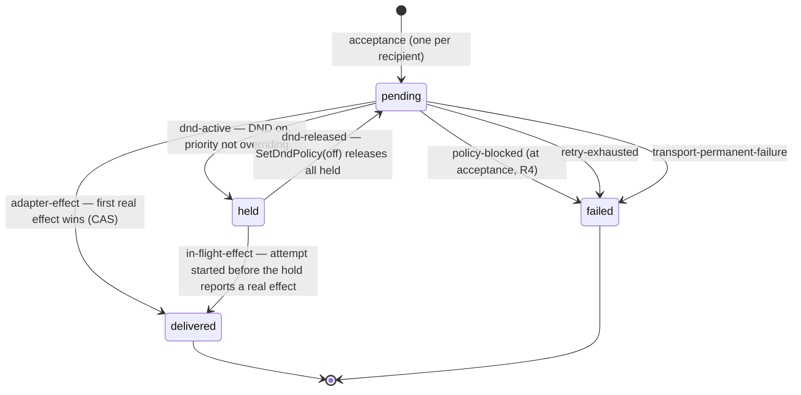

# Messaging — Pass-2 Schemas (Step 2)

**Date:** 2026-07-24 · **Author:** kimi-cli (Step 2 of the amended pass-2 sequence)
**Authority:** derives from `Messaging-Ratification.md` §9/§10 only. Error schemas freeze against
`Messaging-Store-Seam.md` §6 (R6 sequencing note — honoured).
**Status:** binding contract. Step 3b's remaining seam contracts (authority, membership,
presence-transport, clock) freeze against this file; Step 4 regenerates the map from it.
**The single source:** [`contract/messaging-contract.json`](contract/messaging-contract.json).
Every shape below is DEFINED THERE, once (law #3). This document records the *rulings* —
the why — and points at the source. It never re-defines a shape.

---

## 1. What the source file contains

| Section | Contents | Count source |
|---|---|---|
| `records` | Message, Thread, Delivery, DeliveryAttempt, Presence, ContactPolicy, DndPolicy, Template, RecipientSnapshot, AcceptanceRecord | `records` keys |
| `commands` | OpenPresence, ClosePresence, SendMessage, SendFromTemplate, SetDndPolicy, SetContactPolicy, UpsertTemplate, RetireTemplate | `commands` array |
| `queries` | GetThread, ListThreadsForPerson, GetMessages, GetInbox, GetDelivery, GetPolicy, ListTemplates, GetPresence, GetCapabilities | `queries` array |
| `subscriptions` | Subscribe (added by R1 — see §3) | `subscriptions` array |
| `events` | MessageCommitted, DeliveryUpdated, PresenceChanged, PolicyChanged — each classified `committed-fact` or `observation` (R11) | `events` array |
| `errors` | The full typed catalogue — see §8 | `errors` array |
| `stateMachines.delivery` | The R5 machine as data (states, transitions, triggers, reasons) | `stateMachines` |
| `constants` | `messageMaxBytes` (R13/O6), `pageLimitMax` (Store-Seam §4), `subscriptionBufferMax` (R1) | `constants` |

Every durable record carries the I3 envelope (`id`, `kind`, `schemaVersion`, `createdAt`)
and uses branded, prefix-patterned IDs (`person_`, `thread_`, `message_`, …) that cannot
be interchanged (G2). Verify the counts instead of trusting prose:

```bash
node -e 'const c=require("./contract/messaging-contract.json");console.log({records:Object.keys(c.records).length,commands:c.commands.length,queries:c.queries.length,subscriptions:c.subscriptions.length,events:c.events.length,errors:c.errors.length,constants:Object.keys(c.constants).length})'
```

Generators (runtime validators for `public/schemas/`, the contract doc, the Step-4 map)
read this file. Nothing downstream is hand-written.

---

## 2. R5 — Delivery state machine (the heavy ruling)

Four states. Two terminal. All state changes cross the store CAS (`transitionDelivery`,
Store-Seam §5) — the store enforces "expected matches current"; this machine owns which
transitions are legal.



| Sub-question | Ruling |
|---|---|
| **No-presence** | Zero live Presences leaves the Delivery `pending` — never `failed`. There is nothing to retry against and v1 has no expiry (O1). Every `PresenceChanged(opened)` for that recipient re-triggers an attempt decision. |
| **Policy evaluation timing** | DND and contact policy are re-evaluated at EVERY attempt decision point — acceptance, presence-open re-trigger, each retry — against CURRENT policy, never a value cached from acceptance. A presence-open re-trigger during active DND moves `pending → held` instead of attempting. |
| **DND hold** | `pending → held` when recipient DND is on and priority does not override. Held Messages remain pullable via `GetInbox` (guarantee 6) — DND holds attention, never access. Pulling does NOT settle `delivered` (DEC-08: delivered = adapter effect only). |
| **DND release** | `SetDndPolicy(enabled=false)` releases every held Delivery for that Person back to `pending`; normal attempts resume. |
| **In-flight attempt vs hold** | An attempt STARTED before the hold that reports a real adapter effect after `pending → held` settles `held → delivered` (`in-flight-effect`). The effect genuinely occurred (DEC-08) and cannot be un-rung; the CAS `StateConflict` resolves through this transition and the attempt is recorded `effect`. |
| **Urgent with grant** | Skips `held` entirely: immediate attempt, DND notwithstanding (DEC-07, I9). Urgent WITHOUT the grant: `SendAccepted{urgentDowngraded:true}` + the DND path applies — typed, never silent (MSG-010). The flag persists on the `AcceptanceRecord`, so idempotent retries keep the typed outcome (Store-Seam §11 errata 3). |
| **Retry exhaustion** | Attempt budget is adapter configuration (v1 default: 5 attempts, bounded backoff). Exhaustion → `failed{reason: retry-exhausted}`. Permanent adapter failure → `failed{reason: transport-failure}` immediately. |
| **Terminal failure** | `failed` is terminal and observable: `DeliveryUpdated` carries state+reason (MSG-016), `GetDelivery` exposes it. No agent turn is ever created to ack. |
| **Fan-out race** | All live Presences attempted (DEC-16). First real effect transitions to `delivered` via store CAS; late effects get `StateConflict` and are recorded as `DeliveryAttempt{outcome: superseded}` — the race is auditable, never double-settled. |
| **Held never fails** | `held` has no failure transitions: no attempts run while held, so retries cannot exhaust. `held` exits only via `dnd-released` or `in-flight-effect`. |

---

## 3. R1 — the Subscribe contract (new operation)

MSG-023's mechanism, specified as one operation in `subscriptions` (it is neither a
command nor a query — it is a stream). Subscription lifecycle frames
(`started` / `event` / `ended`) are part of the result stream, so the command error
catalogue stays untouched.

| Aspect | Ruling |
|---|---|
| **Operation** | `Subscribe{events[], threads[]?, since?} → stream of SubscriptionMessage`. `events` is required; `threads` empty/absent = all threads the subscriber may read (R3). |
| **Frame routing** | EVERY stream frame (`started` / `event` / `ended`) carries `subscriptionId` — multiple subscriptions may share one connection and remain attributable. |
| **Scope/filter** | By event kind and optional Thread set. No content-predicate filtering in v1 — authorization filtering (R3) is the only payload filter. An explicit `threads[]` naming a Thread the subscriber may NOT read fails the whole Subscribe with `NotAuthorized` — scope is never silently dropped (G6). |
| **Cursor** | The opaque sequence cursor from Store-Seam §3 (`s_<n>`). Survives restarts; malformed/foreign → `ValidationFailed`. |
| **Replay-after-disconnect** | Re-subscribe with `since` = last-seen cursor → committed-fact events with `sequence > cursor` replayed in order from the journal (`scanJournal`, Store-Seam §7), then live. Delivery transitions and policy writes are journaled with sequence (Store-Seam §11 errata 1), so replay covers all three committed-fact kinds (`MessageCommitted`, `DeliveryUpdated`, `PolicyChanged`). Sequence gaps are legal (§3); the consumer compares, never counts. |
| **Duplicate policy** | At-least-once. Committed-fact events carry their `sequence`; the consumer dedupes by sequence. Exactly-once is never promised. |
| **Backpressure** | Bounded per-subscription buffer (`constants.subscriptionBufferMax`). Overflow ENDS the subscription (`ended{reason: overflow}`) — the core never blocks on a slow subscriber. The client re-subscribes with its last cursor; replay closes the gap. |
| **Failure coverage** | Errors: `NotAuthenticated`, `NotAuthorized` (out-of-scope explicit threads), `ValidationFailed` (bad cursor/filter), `DependencyUnavailable` (journal/store failure at subscribe time). Mid-stream dependency failure ends the stream: `ended{reason: dependency-lost}` — re-subscribe with last cursor. |
| **Observations** | `PresenceChanged` carries no sequence, is not journaled, never replays (R11). On (re)subscribe, current presence state is sent as fresh observations. |

This is what makes MSG-023 real: a connected Chief is *pushed to*; polling exists only
as the reconnect-catch-up path.

---

## 4. R2 — subscription push is NOT an addressed Delivery

Two lanes, permanently separate:

| | **Addressed lane** (Delivery) | **Observation lane** (subscription) |
|---|---|---|
| What | Message → one Delivery per snapshot recipient | committed-fact events → subscribers |
| Record | `Delivery` + `DeliveryAttempt`, durable | none — no Delivery is created |
| State machine | R5 machine applies | none |
| DND interaction | Holds the lane (`pending → held`); urgent+grant overrides | **Not gated.** An open subscription is an explicit attention grant; gating it would recreate the polling failure MSG-023 exists to kill. |
| Content filtering | ContactPolicy at acceptance (R4) | Payload filtered to threads the subscriber may read (R3) |
| Guarantee | honest per-recipient outcome (DEC-08, I11) | at-least-once, dedupe by sequence (R1) |

The MSG-023 Chief push is the observation lane. The PTY urgent steer (MSG-008) is the
addressed lane. They never share a record, a state, or a policy gate.

---

## 5. R3 — read/subscription authorization matrix

`NotAuthorized` exactly here, and nowhere else:

| Operation | Rule |
|---|---|
| GetThread / GetMessages / GetDelivery | Thread **member**: direct — one of the canonical pair; room — current member per the membership seam. Membership authority down → `DependencyUnavailable{dependency: membership}`, never a silent allow/deny. |
| GetInbox / ListThreadsForPerson | **Self only** (`policy.admin` may act for others). |
| GetPolicy | Self, or `policy.admin`. |
| GetPresence / ListTemplates | Any authenticated principal — presence and template visibility are observability, not addressing. |
| GetCapabilities | **Pre-authentication** (discovery); reveals versions and limits only. |
| Subscribe payloads | `MessageCommitted` / `DeliveryUpdated` delivered only for threads the subscriber may read (membership rule above). `PresenceChanged` to all authenticated subscribers. `PolicyChanged` to the policy owner + `policy.admin` holders only. |

**Existence side-channel — accepted, written down (v1).** Member-scoped reads
distinguish `NotAuthorized` (exists, not yours) from `UnknownThread`/`UnknownMessage`
(does not exist), so an authenticated principal can probe the existence of another
Person's Threads/Messages by ID. Accepted for v1: IDs are unguessable prefixed
secrets, existence reveals no content, and unifying the denial would degrade honest
callers' errors (a mistyped own-ID would masquerade as an authorization failure).
Revisit only if a deployment treats thread existence itself as sensitive.

---

## 6. R4 — room-send composition

| Question | Ruling |
|---|---|
| Sender membership | The sender MUST be a member of the room Thread at acceptance — checked inside the same membership resolution that freezes the snapshot (R8 linearization). Non-member → `NotAuthorized`. |
| Direct Thread by `thread:` ID | A `thread:`-addressed send that resolves to a DIRECT Thread requires the sender to be one of the canonical pair — otherwise `NotAuthorized`. The recipient is the other pair member and THEIR ContactPolicy applies. A stranger who learns a direct Thread's ID cannot post into it (DEC-03 holds). |
| Blocked recipients — THE choice | **Per-recipient terminal failed Delivery.** The send is accepted; each recipient whose ContactPolicy blocks the sender is recorded in `RecipientSnapshot.blocked` and gets a Delivery created directly in `failed{reason: blocked-by-contact-policy}` (R5: no attempts ever run). Observable via `DeliveryUpdated` + `GetDelivery` — honest (G6), no silent drops, one Message + N Deliveries intact (DEC-05). Rejected: reject-whole (punishes every recipient for one policy) and partial-snapshot (silent exclusion is exactly the old app's failure class). |
| Room-block semantics | Blocking in a room is an honesty SIGNAL, not access control: the failed Delivery records that the blocked recipient was not *notified*, but room history remains readable to them per membership (`GetMessages`, R3) — contact policy cannot rewrite room history (I10). And `GetInbox` never serves terminal Deliveries (Store-Seam §11 errata 2), so the blocked Message does not arrive via the inbox either. |

`BlockedByContactPolicy` remains a *command* error for **direct** sends only — there the
whole send is to one recipient, so rejecting is the honest outcome.

---

## 7. R9–R13 — the small rulings

| Item | Ruling |
|---|---|
| **R9 — Presence lifecycle** | ONE registration mechanism: explicit `OpenPresence`. Authentication alone NEVER registers. Closes: `ClosePresence` (graceful), transport-reported disconnect, or transport-reported liveness timeout — all funnel into one internal close path emitting `PresenceChanged`. Stale detection is the transport adapter's job; the core runs no liveness heuristics (Plan §3 non-goal). Duplicate opens allowed — 0..n Presences per Person (DEC-02), each open mints a new `presenceId`. `ClosePresence` is idempotent: unknown/already-closed succeeds. Only the owning Person (or `policy.admin`) may close; a transport may always close its own connection. |
| **R10 — Override grant** | `priority.override` is a **boolean per principal, global in v1** (not recipient-scoped). The role order (Human > Chief > Manager > EA; Auditor/Worker/Aide never) is authority-adapter configuration and documentation — never core logic (DEC-07 amendment). |
| **R11 — PresenceChanged** | An **observation**, not a committed fact: no sequence, not journaled, never replayed, emitted live. The durability-before-emission rule (§13) applies to committed-fact events only. Classified as `observation` in the source file's `events` array. |
| **R12 — Template allowlist** | Bindable paths are enumerated once in the source file (`templateBindablePaths`): `body.text`, `body.subject`, `body.format`, `body.fields.<name>`, `priority`. Everything core-owned is excluded: `id`, `kind`, `schemaVersion`, `createdAt`, `sequence`, `threadId`, `senderId`, `clientMessageId`, `template`, all delivery metadata. A binding outside the allowlist → `ValidationFailed` at `UpsertTemplate`. |
| **R13 — Constants** | `messageMaxBytes` settled (O6): serialized Message JSON bytes, one schema constant in the source file, enforced at validation; over-limit → `ValidationFailed`. `RateLimited` stays in the catalogue as forward-reserved surface — present in `errors`, absent from every per-operation failure list until O2 activates. |

---

## 8. R6 — public dependency-failure outcomes + the error catalogue resolution

The store seam's failure vocabulary (Store-Seam §6) maps to the public surface exactly
once, in the source file:

| Seam error (§6) | Public outcome |
|---|---|
| `StoreUnavailable`, `StorageExhausted`, `StoreCorrupt` | **`DependencyUnavailable{dependency: store, retryable}`** — one umbrella shape. `retryable: false` marks StoreCorrupt-class (operator intervention). |
| `IdempotencyConflict` | `IdempotencyConflict` — passes through, public by design (A5). |
| `RecordNotFound` | `UnknownThread` / `UnknownMessage` / `UnknownRecipient` / `TemplateNotFound` by context. |
| `CursorInvalid` | `ValidationFailed` (cursor issue path). |
| `StateConflict`, `RevisionConflict` | **Never public.** Normal concurrency outcomes; the core re-reads and re-decides. |
| membership timeout / authority failure | `DependencyUnavailable{dependency: membership|authority}` — same umbrella shape; their seam contracts land in Step 3b and reuse it. |

`DependencyUnavailable` semantics: the catalogue entry is non-retryable BY DEFAULT;
each instance carries its own `retryable` flag (false = StoreCorrupt-class, operator
intervention). The `dependency` enum was finalised at Step 3b as
`store | membership | authority | clock` — presence-transport is DELIBERATELY absent:
its failures surface through the Delivery lane as typed state (Messaging-Seams §4.2).
Consumers MUST tolerate unknown values and treat them as non-retryable.

**Store-Seam §11 errata (same date, same authority):** three gaps found while freezing
against §6 were resolved at the store seam's source — committed-fact events are
journaled with sequence (replay covers `DeliveryUpdated`/`PolicyChanged`), `getInbox`
returns non-terminal Deliveries only, and `AcceptanceRecord` persists
`urgentDowngraded` so DEC-13 retries keep the MSG-010 typed outcome.

**The 11-vs-12 drift, resolved at the source (law #3):** the catalogue is the `errors`
array — nothing else counts. It contains the 11 Plan §9 names **+ `IdempotencyConflict`
(A5) + `DependencyUnavailable` (R6) = 13**, with `RateLimited` forward-reserved (R13).
R13's earlier "12" predated naming R6's public shape; the array is the ruling.

---

## 9. Work-item disposition

| Item | Status | Where |
|---|---|---|
| R5 — Delivery state machine | **CLOSED** | §2; `stateMachines.delivery` |
| R1 — Subscribe contract | **CLOSED** (contract half; transport half lands in Step 3b presence-transport seam) | §3; `subscriptions` |
| R2 — push ≠ Delivery | **CLOSED** | §4 |
| R3 — read/subscription authorization | **CLOSED** | §5; per-operation `authorization` + `errors` |
| R4 — room-send composition | **CLOSED** | §6; `RecipientSnapshot.blocked`, `stateMachines.delivery` |
| R6 — typed public dependency outcomes | **CLOSED** (both halves) | §8; `errors` |
| R9 — Presence lifecycle | **CLOSED** | §7; OpenPresence/ClosePresence, `Presence` |
| R10 — grant semantics | **CLOSED** | §7; `Grant` |
| R11 — PresenceChanged is an observation | **CLOSED** | §7; `events[].classification` |
| R12 — template allowlist | **CLOSED** | §7; `templateBindablePaths` |
| R13 — 32 KiB constant + RateLimited reserved | **CLOSED** | §7; `constants`, `errors` |

**Step 2 closes here.** All Step-2 R-items (R1–R5, R9–R13) plus R6 are closed.
Next: **Step 3b** — remaining seam contracts (authority incl. DEC-07 role→grant config,
membership incl. R8 linearization, presence-transport incl. R1's transport half, clock/ID).

---

## 10. Review record

2026-07-24 — zero-context adversarial review of this document + the contract source
(same protocol as the Step-1 gate review): 1 SEVERE, 7 MEDIUM, 7 LOW. All 15 disposed
in-session, at the source:

- **SEVERE #1** — direct Thread addressable by `thread:` ID without pair membership → §6
  (sender must be one of the pair; recipient is the other member).
- **MEDIUM** — room-block signal-vs-access + inbox leak → §6 + Store-Seam §11 errata 2;
  subscription frames unroutable → `subscriptionId` on every frame (§3); Subscribe
  failure coverage → `NotAuthorized` on explicit out-of-scope threads,
  `DependencyUnavailable`, `ended{reason: dependency-lost}` (§3); replay couldn't cover
  `DeliveryUpdated`/`PolicyChanged` → Store-Seam §11 errata 1; in-flight attempt vs
  DND hold race → `held → delivered` via `in-flight-effect` (§2); DND evaluation
  timing → policy re-evaluated at every attempt decision (§2); existence side-channel
  → accepted and written down (§5).
- **LOW** — GetInbox admin alignment; `urgentDowngraded` persisted for retries (errata 3);
  `MessagePage` doc-hack property removed; `Address` encoding pinned to
  `<kind>:<full durable ID>`; `cli` dropped from presence transports (inbound protocol
  adapter, DEC-17); `DependencyUnavailable` retryable defaults to false with
  per-instance flag + extensible enum (§8).
