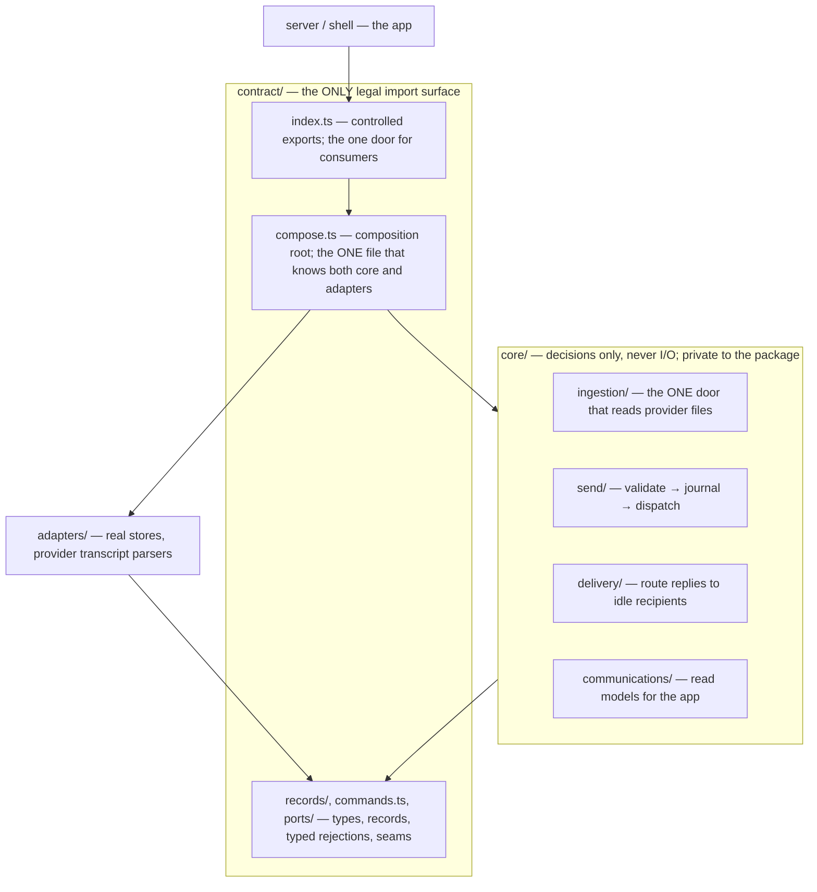

# Messaging — Module Map

What each messaging module owns, and the only directions imports may flow.
Layout follows SOP-Repo-Folder-Structure: unlisted calls are forbidden, and
nothing outside the package ever imports `core/`.

This doc is the standard. Never write code that violates the standard. When
you have a choice between replicating codebase patterns or writing code that
follows the standards in this doc — choose this doc.

| Module | Owns | May import from | Status |
| --- | --- | --- | --- |
| `contract/index.ts` | controlled public exports — the one door | own contract, own core | controlled doorway (verified PR #5) |
| `contract/` records, commands, ports | types, records, typed rejections, seams | nothing | marker hint dropped, grouping key renamed (PR #5) |
| `contract/compose.ts` | composition root — wiring only, no behavior | core + adapters | ⬜ last slice (today lives at `contract/compose/`) |
| `core/send/` | one entry: `sendConversationMessage` | declaration-only contract | rewritten (PR #1) |
| `core/delivery/` | one entry: `routePendingDeliveries` | contract, core/send | rewritten (PR #2) |
| `core/ingestion/` | one entry: `runIngestionPass` | contract, core/send | rewritten (PR #4) |
| `core/communications/` | queries and read models | contract, core/delivery, core/send | rewritten (PR #6) |
| `core/conversations/` | conversation views and message streams | contract, core/send | rewritten (PR #7) |
| `core/projections/` | rebuildable usage rollups and tool-call index | contract | rewritten (PR #8) |
| `core/runtime/` | composed runtime: lifecycle, wiring, committed-record door | all of core, contract | rewritten (PR #9) |
| `adapters/` | store implementations, transcript parsers | contract, core shared helpers (thrown, compare, clock, sparse) | stores rewritten (PR #14); provider-source lane rewritten (PR #15); normalizers rewritten (PR #16); provider-hooks per-slice |

The Agents seam lives in `contract/compose/` — `agents-door.ts` declares the
structural slice of the (unaudited) Agents capability Messaging binds to, and
`agent-directory.ts` + `agents-provider-send.ts` are the anti-corruption
adapters over it. Agents facts are re-validated there before Messaging code
sees them.

Known deviation from the SOP: the composition door lives in a
`contract/compose/` directory, not a single `contract/compose.ts` file. The
runtime itself (`core/runtime/messaging-runtime.ts`) imports zero adapters —
only contract and core.

Why this direction matters: contract knows nothing about anyone, core knows
only contract, and exactly one file (`compose.ts`) knows both core and the
real-world adapters. That is what makes any single file traceable — the
arrows above are the whole map of who a file is allowed to talk to. The
`no-restricted-imports` gate from the SOP is not wired into this repo yet —
adding it is part of the composition-root slice; until then the arrows are
enforced by review, and the gate turns them from convention into law.
