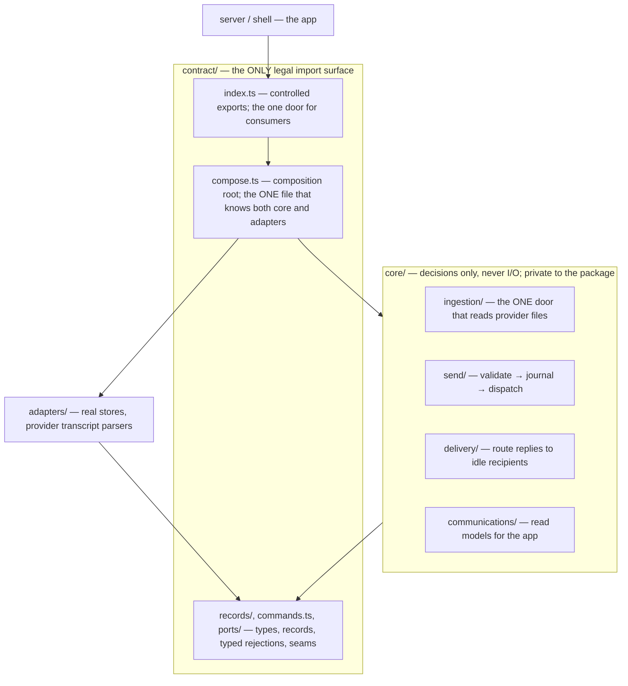

# Messaging — Module Map

What each messaging module owns, and the only directions imports may flow.
Layout follows SOP-Repo-Folder-Structure: unlisted calls are forbidden, and
nothing outside the package ever imports `core/`.

| Module | Owns | May import from | Status |
| --- | --- | --- | --- |
| `contract/index.ts` | controlled public exports — the one door | own contract, own core | ⬜ currently a barrel — needs its own slice |
| `contract/` records, commands, ports | types, records, typed rejections, seams | nothing | partially rewritten |
| `contract/compose.ts` | composition root — wiring only, no behavior | core + adapters | ⬜ last slice (today lives at `core/runtime/`) |
| `core/send/` | one entry: `sendConversationMessage` | declaration-only contract | ✅ gold (PR #1) |
| `core/delivery/` | one entry: `routePendingDeliveries` | contract, core/send | ✅ gold (PR #2) |
| `core/ingestion/` | one entry: `runIngestionPass` | contract, core/send | ⬜ next slice |
| `core/communications/` | queries and read models | contract | ⬜ not started |
| `adapters/` | store implementations, transcript parsers | contract only | ⬜ per-slice, as touched |

Known deviations from the SOP, to be closed by the slices above: the
composition root currently sits at `core/runtime/messaging-runtime.ts`
(a forbidden `core → adapters` edge), and `contract/index.ts` re-exports
everything instead of controlling the public surface.

Why this direction matters: contract knows nothing about anyone, core knows
only contract, and exactly one file (`compose.ts`) knows both core and the
real-world adapters. That is what makes any single file traceable — the
arrows above are the whole map of who a file is allowed to talk to. The
`no-restricted-imports` gate from the SOP is not wired into this repo yet —
adding it is part of the composition-root slice; until then the arrows are
enforced by review, and the gate turns them from convention into law.
